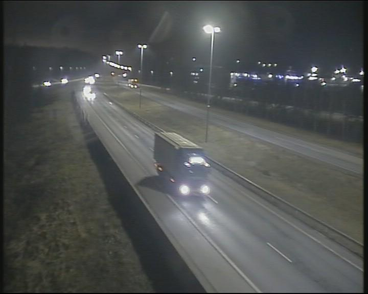

<!-- WARNING: THIS FILE WAS AUTOGENERATED! DO NOT EDIT! -->

``` python
from IPython.display import Image
from llmcam.gpt4v import *
from llmcam.yolo import *
from llmcam.fn_to_fc import *
from llmcam.downloader import *
import json
```

## build an addressbook of camera installed address, and image capture url

    [
        {
            "address": <camera installed location>,
            "url": <capture image url>,
        },
        {
            "address": <camera installed location>,
            "url": <capture image url>,
        },
        ....
    ]

``` python
def build_address_book(stations_url:str):
    table = []
    stations = requests.get(stations_url).json()['features']
    for station in stations:
        station = requests.get(stations_url+'/'+station['id']).json().get('properties')
        if not station:
            continue
        for preset in station['presets']:
            try:
                addr = ",".join([preset['presentationName'], station['names'].get('fi'), station['municipality'], station['province']])
            except:
                continue
            info = {
                #"id": preset['id'],
                "address": addr,
                "url": preset['imageUrl'],
            }
            table.append(info)
    return table
```

``` python
def address_book(stations_url:str=stations_url, force_update=False):
    """get an address book [{"address":<camera installed address>, "url":<image capture url>}]"""
    if not force_update and os.path.exists("preset_image_url.json"):
        with open("preset_image_url.json", "r") as f:
            return json.load(f)
    raise
    data = build_address_book(stations_url)
    with open("preset_image_url.json", "w") as f:
        json.dump(data, f, indent=4) 
    return data
```

------------------------------------------------------------------------

<a
href="https://github.com/ninjalabo/llmcam/blob/main/llmcam/dtcam.py#L18"
target="_blank" style="float:right; font-size:smaller">source</a>

### camera_address_book

>  camera_address_book (stations_url:str='https://tie.digitraffic.fi/api/wea
>                           thercam/v1/stations', update:bool=False)

*get weather camera location addressbook of
`camera location`:`image url`. You can get an capture of camera from
this url*

<table>
<colgroup>
<col style="width: 6%" />
<col style="width: 25%" />
<col style="width: 34%" />
<col style="width: 34%" />
</colgroup>
<thead>
<tr>
<th></th>
<th><strong>Type</strong></th>
<th><strong>Default</strong></th>
<th><strong>Details</strong></th>
</tr>
</thead>
<tbody>
<tr>
<td>stations_url</td>
<td>str</td>
<td>https://tie.digitraffic.fi/api/weathercam/v1/stations</td>
<td>Weather Camera URL</td>
</tr>
<tr>
<td>update</td>
<td>bool</td>
<td>False</td>
<td>Update addressbook forcely</td>
</tr>
<tr>
<td><strong>Returns</strong></td>
<td><strong>str</strong></td>
<td></td>
<td><strong>List of
<code>"camera location"</code>:<code>"image url"</code></strong></td>
</tr>
</tbody>
</table>

``` python
tools = [tool_schema(f) for f in [camera_address_book, download_file, ask_gpt4v_about_image_file]]
msgs = form_msgs([
    ("system", "You are a helpful system administrator. Use the supplied tools to assist the user."),
    ("user", "Pick up the camera location closer to Espoo Kehä I Itään from camera address book"),
])
complete(msgs, tools=tools)
msgs.append(form_msg("user", "download captured images"))
complete(msgs, tools=tools)
msgs.append(form_msg("user", "How many cars are seen?"))
complete(msgs, tools=tools)
print_msgs(msgs)
```

    >> System:
    You are a helpful system administrator. Use the supplied tools to assist the user.
    >> User:
    Pick up the camera location closer to Espoo Kehä I Itään from camera address book
    >> Assistant:
    The camera location closer to Espoo Kehä I Itään is located at:  - Address: Kehä1 - Itään, Tie 101
    Espoo Turvesuontie, Espoo, Uusimaa - Camera Image URL: [View
    Image](https://weathercam.digitraffic.fi/C0152101.jpg)  You can view the real-time image from this
    weather camera by following the link provided.
    >> User:
    download captured images
    >> Assistant:
    The captured image from the camera at Kehä1 - Itään, Espoo Turvesuontie has been downloaded
    successfully. You can find the image file saved as
    [Kehä1_Itään_Espoo_Turvesuontie.jpg](sandbox:/Kehä1_Itään_Espoo_Turvesuontie.jpg).
    >> User:
    How many cars are seen?
    >> Assistant:
    There are 15 cars visible in the captured image from the Kehä1 - Itään, Espoo Turvesuontie camera.

## Simple capture function

------------------------------------------------------------------------

<a
href="https://github.com/ninjalabo/llmcam/blob/main/llmcam/dtcam.py#L27"
target="_blank" style="float:right; font-size:smaller">source</a>

### stations

>  stations (key:str)

*Get all weather station including `key` word*

``` python
Porvoos = stations("Porvoo")
assert "porvoo" in Porvoos[0]['properties']['name'].lower()
```

------------------------------------------------------------------------

<a
href="https://github.com/ninjalabo/llmcam/blob/main/llmcam/dtcam.py#L35"
target="_blank" style="float:right; font-size:smaller">source</a>

### presets

>  presets (station:dict)

*Get all presets at a given weather station*

``` python
preset = presets(Porvoos[0])[0]
imageUrl = preset['imageUrl']
print(imageUrl)
assert "jpg" in imageUrl
```

    https://weathercam.digitraffic.fi/C0150200.jpg

------------------------------------------------------------------------

<a
href="https://github.com/ninjalabo/llmcam/blob/main/llmcam/dtcam.py#L43"
target="_blank" style="float:right; font-size:smaller">source</a>

### capture

>  capture (preset:dict)

*Capture image at a given preset location in a Weather station, and
return an image path*

``` python
preset
```

    {'id': 'C0150200',
     'presentationName': 'Porvoo',
     'inCollection': True,
     'resolution': '704x576',
     'directionCode': '0',
     'imageUrl': 'https://weathercam.digitraffic.fi/C0150200.jpg',
     'direction': 'UNKNOWN'}

``` python
hdr, path = capture(preset)
hdr
```

    {'Content-Type': 'image/jpeg', 'Content-Length': '60012', 'Connection': 'keep-alive', 'x-amz-id-2': 'w+yqdpf7tZ9TDum/EbtricEAo7ZKhFBapv8ZUJkdgtuNrpq3tLAsSEkftWwgJTNMOQSrrNBnRtkBGZxDeJ43xWFX4N91PVXK', 'x-amz-request-id': 'RBE1D921ZZWEB5HH', 'Date': 'Mon, 02 Dec 2024 15:56:45 GMT', 'last-modified': 'Mon, 02 Dec 2024 15:53:57 GMT', 'x-amz-expiration': 'expiry-date="Wed, 04 Dec 2024 00:00:00 GMT", rule-id="Delete versions and current images after 24h"', 'ETag': '"a861dea222eb420ce843ab452b951c48"', 'x-amz-server-side-encryption': 'AES256', 'X-Amz-Meta-Last-Modified': 'Mon, 02 Dec 2024 15:53:57 GMT', 'x-amz-version-id': '56F0NGOAtHYClDerv02t8aouHe6DXYUB', 'Accept-Ranges': 'bytes', 'Server': 'AmazonS3', 'X-Cache': 'Miss from cloudfront', 'Via': '1.1 f13aef0c4b52f6f681401f232d03eb68.cloudfront.net (CloudFront)', 'X-Amz-Cf-Pop': 'HIO50-C1', 'Alt-Svc': 'h3=":443"; ma=86400', 'X-Amz-Cf-Id': 'bZ16EpFgXU3OqxtBO7Yqj3bJCF48sWd5j8_ShgdGzXsZhbTKnqwzyA=='}

``` python
display(Image.open(path))
```



------------------------------------------------------------------------

<a
href="https://github.com/ninjalabo/llmcam/blob/main/llmcam/dtcam.py#L57"
target="_blank" style="float:right; font-size:smaller">source</a>

### cap

>  cap (key:str='Porvoo')

*Capture an image at specified location, save it, and return its path*

<table>
<thead>
<tr>
<th></th>
<th><strong>Type</strong></th>
<th><strong>Default</strong></th>
<th><strong>Details</strong></th>
</tr>
</thead>
<tbody>
<tr>
<td>key</td>
<td>str</td>
<td>Porvoo</td>
<td>location keyword</td>
</tr>
<tr>
<td><strong>Returns</strong></td>
<td><strong>str</strong></td>
<td></td>
<td></td>
</tr>
</tbody>
</table>

``` python
path = cap("porvoo")
print(path)
ask_gpt4v(path)
```

    ../data/cap_2024.12.02_15:53:57_Porvoo_C0150200.jpg

    {'dimensions': '720 x 576',
     'building': 0,
     'car': 4,
     'truck': 1,
     'available_parking_space': 0,
     'street_lights': 7,
     'person': 0,
     'time_of_day': 'night',
     'artificial_lighting': 'prominent',
     'visibility_clear': True,
     'sky_visible': True,
     'sky_light_conditions': 'dark'}

``` python
detect_objects(cap('porvoo'))
```


    image 1/1 /home/doyu/00llmcam/nbs/../data/cap_2024.12.02_15:53:57_Porvoo_C0150200.jpg: 512x640 1 car, 208.4ms
    Speed: 7.1ms preprocess, 208.4ms inference, 6.1ms postprocess per image at shape (1, 3, 512, 640)

    '{"car": 1}'

``` python
def __ask_gpt4v(
    path: str # file path to analyze
)->str:
    "ask gpt4v to analyze an image given"
    return json.dumps(ask_gpt4v(path))
```

------------------------------------------------------------------------

### \_\_ask_gpt4v

>  __ask_gpt4v (path:str)

*ask gpt4v to analyze an image given*

<table>
<thead>
<tr>
<th></th>
<th><strong>Type</strong></th>
<th><strong>Details</strong></th>
</tr>
</thead>
<tbody>
<tr>
<td>path</td>
<td>str</td>
<td>file path to analyze</td>
</tr>
<tr>
<td><strong>Returns</strong></td>
<td><strong>str</strong></td>
<td></td>
</tr>
</tbody>
</table>

``` python
tools = [tool_schema(f) for f in [cap, detect_objects, __ask_gpt4v] ]
tools
```

    [{'type': 'function',
      'function': {'name': 'cap',
       'description': 'Capture an image at specified location, save it, and return its path',
       'parameters': {'type': 'object',
        'properties': {'key': {'type': 'string',
          'description': 'location keyword'}},
        'required': []},
       'metadata': {'module': '__main__', 'service': '__main__'}}},
     {'type': 'function',
      'function': {'name': 'detect_objects',
       'description': 'Detect object in the input image.',
       'parameters': {'type': 'object',
        'properties': {'image_path': {'type': 'string',
          'description': 'Path/URL of image'},
         'conf': {'type': 'number', 'description': 'Confidence threshold'}},
        'required': ['image_path']},
       'metadata': {'module': 'llmcam.yolo', 'service': 'llmcam.yolo'}}},
     {'type': 'function',
      'function': {'name': '__ask_gpt4v',
       'description': 'ask gpt4v to analyze an image given',
       'parameters': {'type': 'object',
        'properties': {'path': {'type': 'string',
          'description': 'file path to analyze'}},
        'required': ['path']},
       'metadata': {'module': '__main__', 'service': '__main__'}}}]

``` python
def callback(name, tools=[], **kwargs): return globals().get(name)(**kwargs)
```

``` python
msgs = form_msgs([
    ("system", "You are a helpful system administrator. Use the supplied tools to assist the user."),
    ("user", "Capture an image in Porvoo and tell me the path"),
])
complete(msgs, tools=tools)
```

    ('assistant',
     'The image has been captured in Porvoo. You can find it at the following path: `../data/cap_2024.12.02_15:53:57_Porvoo_C0150200.jpg`.')

``` python
msgs.append(form_msg("user", f"analyze this captured image"))
complete(msgs, tools=tools)
```

    ('assistant',
     'The analysis of the captured image from Porvoo reveals the following details:\n\n- **Dimensions**: 720 x 576 pixels\n- **Objects Detected**:\n  - 1 Truck\n  - 4 Cars\n  - 5 Street lights\n- **Time of Day**: Night\n- **Lighting Conditions**: Prominent artificial lighting\n- **Visibility**: Clear\n- **Sky Visibility**: Not visible\n- **Water Bodies**: Not visible\n\nThis suggests a clear night scene with vehicular presence and strong street lighting.')

``` python
msgs.append(form_msg("user", "Can you detect objects in the file?"))
complete(msgs, tools=tools)
```


    image 1/1 /home/doyu/00llmcam/nbs/../data/cap_2024.12.02_15:53:57_Porvoo_C0150200.jpg: 512x640 1 car, 162.3ms
    Speed: 2.2ms preprocess, 162.3ms inference, 1.0ms postprocess per image at shape (1, 3, 512, 640)

    ('assistant',
     'The object detection in the captured image from Porvoo identified the following:\n\n- **1 Car**\n\nIt seems there was one car detected in the image.')
