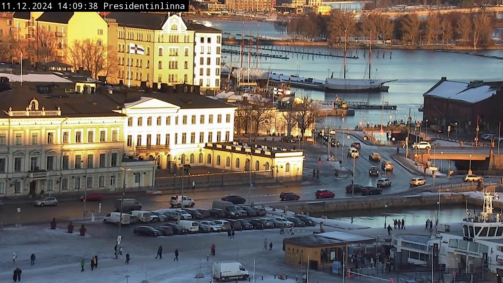

# Ask GPT-4v


<!-- WARNING: THIS FILE WAS AUTOGENERATED! DO NOT EDIT! -->

## Process images with GPT

A simple approach to process image with GPT is to encode image as base64
string and ask about its information. Starting with some local images:

``` python
import os
from pathlib import Path

data_path = Path(os.getenv("LLMCAM_DATA", "../data")).absolute()
files = sorted(glob.glob(f"{data_path}/cap_*.jpg"))
len(files), files[:9]
```

    (551,
     ['/home/nghivo/tinyMLaaS/llmcam/data/cap_2024.09.28_15:59:06_Presidentinlinna.jpg',
      '/home/nghivo/tinyMLaaS/llmcam/data/cap_2024.09.28_16:00:11_Presidentinlinna.jpg',
      '/home/nghivo/tinyMLaaS/llmcam/data/cap_2024.09.28_16:01:16_Etelasatama.jpg',
      '/home/nghivo/tinyMLaaS/llmcam/data/cap_2024.09.28_16:02:21_Etelasatama.jpg',
      '/home/nghivo/tinyMLaaS/llmcam/data/cap_2024.09.28_16:05:31_Olympiaterminaali.jpg',
      '/home/nghivo/tinyMLaaS/llmcam/data/cap_2024.09.28_16:06:36_Olympiaterminaali.jpg',
      '/home/nghivo/tinyMLaaS/llmcam/data/cap_2024.09.28_16:07:41_Torni.jpg',
      '/home/nghivo/tinyMLaaS/llmcam/data/cap_2024.09.28_16:09:51_Tuomiokirkko.jpg',
      '/home/nghivo/tinyMLaaS/llmcam/data/cap_2024.09.28_16:15:11_Presidentinlinna.jpg'])

``` python
Image(files[-1])
```



------------------------------------------------------------------------

<a
href="https://github.com/ninjalabo/llmcam/blob/main/llmcam/vision/gpt4v.py#L17"
target="_blank" style="float:right; font-size:smaller">source</a>

### encode_image

>  encode_image (fname:str)

*Encode an image file as base64 string*

Example of encoding:

``` python
base64_image = encode_image(files[0])
base64_image[:9]
```

    '/9j/4AAQS'

With the encoded image, we can use OpenAI API to intiate a conversation
asking about the image. We can also specify the format of outputs:

``` python
response = openai.chat.completions.create(
  model="gpt-4o",
  messages=[{
        "role": "user",
        "content": [
            {"type": "text", "text": question,},
            {
                "type": "image_url",
                "image_url": {"url": f"data:image/jpeg;base64,{encode_image(files[-1])}", "detail":"high",},
            },
        ],
    }],
  max_tokens=300,
)
response.choices[0].message.content
```

    '```json\n{\n    "timestamp": "2024-12-11T14:09:38",\n    "location": "Kauppatori",\n    "dimensions": "1280 x 720",\n    "building": 6,\n    "buildings_height_range": "3-6 stories",\n    "car": 7,\n    "truck": 1,\n    "boat": 2,\n    "available_parking_space": 15,\n    "street_lights": 10,\n    "person": 12,\n    "time_of_day": "afternoon",\n    "artificial_lighting": "minimal",\n    "visibility_clear": true,\n    "sky_visible": true,\n    "sky_light_conditions": "daylight",\n    "waterbodies_visible": true,\n    "waterbodies_type": "harbor"\n}\n```'

It is clear that we need some extra processing steps to convert the
JSON-formatted data in strings into Python dictionary.

------------------------------------------------------------------------

<a
href="https://github.com/ninjalabo/llmcam/blob/main/llmcam/vision/gpt4v.py#L50"
target="_blank" style="float:right; font-size:smaller">source</a>

### info

>  info (response)

``` python
info(response)
```

    /tmp/ipykernel_49821/2561472427.py:3: PydanticDeprecatedSince20: The `json` method is deprecated; use `model_dump_json` instead. Deprecated in Pydantic V2.0 to be removed in V3.0. See Pydantic V2 Migration Guide at https://errors.pydantic.dev/2.10/migration/
      txt = json.loads(response.json())['choices'][0]['message']['content']

    {'timestamp': '2024-12-11T14:09:38',
     'location': 'Kauppatori',
     'dimensions': '1280 x 720',
     'building': 6,
     'buildings_height_range': '3-6 stories',
     'car': 7,
     'truck': 1,
     'boat': 2,
     'available_parking_space': 15,
     'street_lights': 10,
     'person': 12,
     'time_of_day': 'afternoon',
     'artificial_lighting': 'minimal',
     'visibility_clear': True,
     'sky_visible': True,
     'sky_light_conditions': 'daylight',
     'waterbodies_visible': True,
     'waterbodies_type': 'harbor'}

Let us summarize this whole process with a single function to be
integrated into GPT Function calling.

------------------------------------------------------------------------

<a
href="https://github.com/ninjalabo/llmcam/blob/main/llmcam/vision/gpt4v.py#L56"
target="_blank" style="float:right; font-size:smaller">source</a>

### ask_gpt4v_about_image_file

>  ask_gpt4v_about_image_file (path:str)

*Tell all about quantitative information from a given image file*

<table>
<colgroup>
<col style="width: 9%" />
<col style="width: 38%" />
<col style="width: 52%" />
</colgroup>
<thead>
<tr>
<th></th>
<th><strong>Type</strong></th>
<th><strong>Details</strong></th>
</tr>
</thead>
<tbody>
<tr>
<td>path</td>
<td>str</td>
<td>Path to the image file</td>
</tr>
<tr>
<td><strong>Returns</strong></td>
<td><strong>str</strong></td>
<td><strong>JSON string with quantitative information</strong></td>
</tr>
</tbody>
</table>

Test with the previous data file:

``` python
ask_gpt4v_about_image_file(files[-1])
```

    /tmp/ipykernel_49821/2561472427.py:3: PydanticDeprecatedSince20: The `json` method is deprecated; use `model_dump_json` instead. Deprecated in Pydantic V2.0 to be removed in V3.0. See Pydantic V2 Migration Guide at https://errors.pydantic.dev/2.10/migration/
      txt = json.loads(response.json())['choices'][0]['message']['content']

    {'timestamp': '2024-12-11T14:09:38',
     'location': 'Presidentinlinna',
     'dimensions': '1280 x 720',
     'building': 10,
     'buildings_height_range': '3-6 stories',
     'car': 10,
     'truck': 1,
     'boat': 3,
     'available_parking_space': 5,
     'street_lights': 15,
     'person': 20,
     'time_of_day': 'afternoon',
     'artificial_lighting': 'minimal',
     'visibility_clear': True,
     'sky_visible': True,
     'sky_light_conditions': 'daylight',
     'waterbodies_visible': True,
     'waterbodies_type': 'harbor'}

## Simulated GPT workflow

This section tests integrating with our current GPT framework. This
function can be used in combination with `ytlive` module:

``` python
from llmcam.core.fc import *
from llmcam.core.fn_to_schema import function_schema
from llmcam.vision.ytlive import capture_youtube_live_frame

tools = [
    function_schema(capture_youtube_live_frame, "Youtube Live Capture"),
    function_schema(ask_gpt4v_about_image_file, "GPT4 Vision"),
]
messages = form_msgs([
    ("system", "You are a helpful system administrator. Use the supplied tools to assist the user."),
    ("user", "Hi, can you capture a YouTube Live? Use the default link.")
])
complete(messages, tools=tools)
print_msgs(messages)
```

    [youtube] Extracting URL: https://www.youtube.com/watch?v=LMZQ7eFhm58
    [youtube] LMZQ7eFhm58: Downloading webpage
    [youtube] LMZQ7eFhm58: Downloading ios player API JSON
    [youtube] LMZQ7eFhm58: Downloading mweb player API JSON
    [youtube] LMZQ7eFhm58: Downloading m3u8 information
    [youtube] LMZQ7eFhm58: Downloading m3u8 information
    11.12.2024 17:27:23 Tuomiokirkko
    >> System:
    You are a helpful system administrator. Use the supplied tools to assist the user.
    >> User:
    Hi, can you capture a YouTube Live? Use the default link.
    >> Assistant:
    I have captured an image from the default YouTube Live stream. You can find the image at the
    following path: `/home/nghivo/tinyMLaaS/llmcam/data/cap_2024.12.11_17:27:23_Tuomiokirkko.jpg`.

``` python
# Continue the conversation and ask about the image file
messages.append(form_msg("user", "Can you extract information about this image?"))
complete(messages, tools=tools)
print_msgs(messages)
```

    /tmp/ipykernel_49821/2561472427.py:3: PydanticDeprecatedSince20: The `json` method is deprecated; use `model_dump_json` instead. Deprecated in Pydantic V2.0 to be removed in V3.0. See Pydantic V2 Migration Guide at https://errors.pydantic.dev/2.10/migration/
      txt = json.loads(response.json())['choices'][0]['message']['content']

    >> System:
    You are a helpful system administrator. Use the supplied tools to assist the user.
    >> User:
    Hi, can you capture a YouTube Live? Use the default link.
    >> Assistant:
    I have captured an image from the default YouTube Live stream. You can find the image at the
    following path: `/home/nghivo/tinyMLaaS/llmcam/data/cap_2024.12.11_17:27:23_Tuomiokirkko.jpg`.
    >> User:
    Can you extract information about this image?
    >> Assistant:
    Here's the information extracted from the image captured:  - **Timestamp**: 2024-12-11 17:27:23 -
    **Location**: Tuomiokirkko - **Image Dimensions**: 1280 x 720 pixels - **Buildings Count**: 15 -
    **Building Heights**: Range from 3 to 5 stories - **Vehicles**:    - Cars: 0   - Trucks: 0   -
    Boats: 0 - **Available Parking Spaces**: 0 - **Street Lights**: 10 - **People**: 5 counted - **Time
    of Day**: Evening - **Artificial Lighting**: Prominent in the image - **Visibility**: Clear - **Sky
    Conditions**: Visible, nighttime conditions - **Waterbodies**: Not visible  If you need more
    detailed information or further assistance, feel free to ask!
