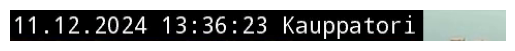
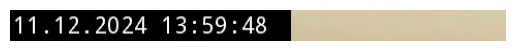

# YouTube Live Capture


<!-- WARNING: THIS FILE WAS AUTOGENERATED! DO NOT EDIT! -->

## Youtube Live Capture experiment

This experiment focuses on capturing Youtube Live from public cameras
monitoring multiple Näkymä Helsingistä locations. We can first extract
information about the Youtube Live using the library `yt_dlp`.

------------------------------------------------------------------------

<a
href="https://github.com/ninjalabo/llmcam/blob/main/llmcam/vision/ytlive.py#L47"
target="_blank" style="float:right; font-size:smaller">source</a>

### stream_url

>  stream_url (ytlive_url:str, ydl_opts:dict)

``` python
stream_url(nakyma_helsinkigista_youtube_live_url, ydl_opts)
```

    [youtube] Extracting URL: https://www.youtube.com/watch?v=LMZQ7eFhm58
    [youtube] LMZQ7eFhm58: Downloading webpage
    [youtube] LMZQ7eFhm58: Downloading ios player API JSON
    [youtube] LMZQ7eFhm58: Downloading mweb player API JSON
    [youtube] LMZQ7eFhm58: Downloading m3u8 information
    [youtube] LMZQ7eFhm58: Downloading m3u8 information

    'https://manifest.googlevideo.com/api/manifest/hls_playlist/expire/1733937992/ei/6HZZZ-vpA_PMv_IPysGz2Qw/ip/82.130.25.234/id/LMZQ7eFhm58.5/itag/232/source/yt_live_broadcast/requiressl/yes/ratebypass/yes/live/1/sgovp/gir%3Dyes%3Bitag%3D136/rqh/1/hdlc/1/hls_chunk_host/rr2---sn-ovgq0oxu-5goe.googlevideo.com/xpc/EgVo2aDSNQ%3D%3D/playlist_duration/3600/manifest_duration/3600/spc/x-caUEc_EBBbzpRqDiJfPgXvx7yjLWPePyyAzwIl_DBmcEdrC7w2/vprv/1/playlist_type/DVR/initcwndbps/4007500/met/1733916392,/mh/l8/mm/44/mn/sn-ovgq0oxu-5goe/ms/lva/mv/m/mvi/2/pl/21/rms/lva,lva/dover/13/pacing/0/short_key/1/keepalive/yes/fexp/51326932,51335594,51347746/mt/1733915792/sparams/expire,ei,ip,id,itag,source,requiressl,ratebypass,live,sgovp,rqh,hdlc,xpc,playlist_duration,manifest_duration,spc,vprv,playlist_type/sig/AJfQdSswRgIhAMlMgl_cCJAuOFhXjrizCgIsFw8ImV3yleBDX1TMJL4YAiEAtnfNoXhxIWxW5sdFlUSIohwrPq0xSxRtjWuV9wiXLvU%3D/lsparams/hls_chunk_host,initcwndbps,met,mh,mm,mn,ms,mv,mvi,pl,rms/lsig/AGluJ3MwRAIgA8xmaKZl2jIYpBKZMnj4us-viVz8CwzCOEScKRxk4m0CIAVtZlY4HZYve_rWg8fC2TkJuXyrXT60XtJXAXrGVxvh/playlist/index.m3u8'

At this point, we have obtained a special link for downloading captures
from this livestream. This URL is a dynamically generated link used by
YouTube for delivering live streaming content via an HLS (HTTP Live
Streaming) protocol. We can proceed to donwload content chunks from this
link with `cv2`.

**NOTE**: This livestream contains a small frame at top left corner to
display the current time and location. We can attempt to crop this small
frame and extract further information from the captured image.

------------------------------------------------------------------------

<a
href="https://github.com/ninjalabo/llmcam/blob/main/llmcam/vision/ytlive.py#L57"
target="_blank" style="float:right; font-size:smaller">source</a>

### show_frame

>  show_frame (frame)

------------------------------------------------------------------------

<a
href="https://github.com/ninjalabo/llmcam/blob/main/llmcam/vision/ytlive.py#L64"
target="_blank" style="float:right; font-size:smaller">source</a>

### crop_frame

>  crop_frame (frame, crop=(0, 0, 480, 30))

------------------------------------------------------------------------

<a
href="https://github.com/ninjalabo/llmcam/blob/main/llmcam/vision/ytlive.py#L69"
target="_blank" style="float:right; font-size:smaller">source</a>

### frame_to_text

>  frame_to_text (frame)

------------------------------------------------------------------------

<a
href="https://github.com/ninjalabo/llmcam/blob/main/llmcam/vision/ytlive.py#L72"
target="_blank" style="float:right; font-size:smaller">source</a>

### known

>  known (txt:str, known_places:str)

*Try to find one of `known_places` are included in the given `txt`*

------------------------------------------------------------------------

<a
href="https://github.com/ninjalabo/llmcam/blob/main/llmcam/vision/ytlive.py#L81"
target="_blank" style="float:right; font-size:smaller">source</a>

### meta

>  meta (frame, known_places=['Olympiaterminaali', 'Etelasatama',
>            'Eteladsatama', 'Presidentinlinna', 'Tuomiokirkko', 'Kauppatori',
>            'Kauppator', 'Torni', 'Valkosaari'], printing=False)

*Withdraw meta data, datetime & place*

------------------------------------------------------------------------

<a
href="https://github.com/ninjalabo/llmcam/blob/main/llmcam/vision/ytlive.py#L94"
target="_blank" style="float:right; font-size:smaller">source</a>

### fname

>  fname (prefix, dt, pl)

Test workflow combining the above utilities and try saving the
downloaded file in a local directory:

``` python
url = stream_url(nakyma_helsinkigista_youtube_live_url, ydl_opts)
cap = cv2.VideoCapture(url)
ret, frame = cap.read()
if ret:
    print("Cropped frame:")
    show_frame(crop_frame(frame))

    print("Text in cropped frame:", frame_to_text(crop_frame(frame)))
    try:
        file_name = fname("cap_", *meta(crop_frame(frame), printing=True))
    except:
        file_name = fname("fail_", datetime.now(), "nowhere")
    print("File name:", file_name)
    path = Path(os.getenv("LLMCAM_DATA", "../data"))/file_name
    path.parent.mkdir(parents=True, exist_ok=True)
    cv2.imwrite(path, frame)
    print("Saved to:", path)
else:
    print("Failed to capture frame.")
```

    [youtube] Extracting URL: https://www.youtube.com/watch?v=LMZQ7eFhm58
    [youtube] LMZQ7eFhm58: Downloading webpage
    [youtube] LMZQ7eFhm58: Downloading ios player API JSON
    [youtube] LMZQ7eFhm58: Downloading mweb player API JSON
    [youtube] LMZQ7eFhm58: Downloading m3u8 information
    [youtube] LMZQ7eFhm58: Downloading m3u8 information
    Cropped frame:



    Text in cropped frame: 11.12.2024 13:36:23 Kauppatori [in
    11.12.2024 13:36:23 Kauppatori [in
    File name: cap_2024.12.11_13:36:23_Kauppatori.jpg
    Saved to: /home/nghivo/tinyMLaaS/llmcam/data/cap_2024.12.11_13:36:23_Kauppatori.jpg

As such, we can follow this guideline for implementing the modularized
functions:

1.  Extract HSL URL from Youtube Live  
2.  Capture live images with this URL  
3.  Crop small frame and extract further metadata from captured images  
4.  Form suitable file names and save captured images

## Modularize with Live instances

This section implements the modularized functions with Object-Oriented
Programming approach (OOP). Each Youtube Live is managed by a
[`YTLive`](https://ninjalabo.github.io/llmcam/vision/ytlive.html#ytlive)
instance, which captures images from its live stream when prompted.

### General Live instance

**NOTE**: For a generic Youtube Live stream, step 3 in the described
workflow is skipped and file name is generated as a combination of the
current timestamp and user-input location.

------------------------------------------------------------------------

<a
href="https://github.com/ninjalabo/llmcam/blob/main/llmcam/vision/ytlive.py#L97"
target="_blank" style="float:right; font-size:smaller">source</a>

### YTLive

>  YTLive (url:str, data_dir:Optional[pathlib.Path]=Path('../data'),
>              place:Optional[str]='nowhere')

*Initialize self. See help(type(self)) for accurate signature.*

<table>
<thead>
<tr>
<th></th>
<th><strong>Type</strong></th>
<th><strong>Default</strong></th>
<th><strong>Details</strong></th>
</tr>
</thead>
<tbody>
<tr>
<td>url</td>
<td>str</td>
<td></td>
<td>YouTube Live URL</td>
</tr>
<tr>
<td>data_dir</td>
<td>Optional</td>
<td>../data</td>
<td>Directory to store captured images</td>
</tr>
<tr>
<td>place</td>
<td>Optional</td>
<td>nowhere</td>
<td>Location name</td>
</tr>
</tbody>
</table>

Test usage with a different live stream of Santa Claus Village:

``` python
SantaClausVillage = YTLive(url="https://www.youtube.com/live/Cp4RRAEgpeU?si=IwqJ4QU1Umv9PdgW", place="santaclausvillage")
file = SantaClausVillage()
print()
print("File path:", file)
```

    [youtube] Extracting URL: https://www.youtube.com/live/Cp4RRAEgpeU?si=IwqJ4QU1Umv9PdgW
    [youtube] Cp4RRAEgpeU: Downloading webpage
    [youtube] Cp4RRAEgpeU: Downloading ios player API JSON
    [youtube] Cp4RRAEgpeU: Downloading mweb player API JSON
    [youtube] Cp4RRAEgpeU: Downloading m3u8 information
    [youtube] Cp4RRAEgpeU: Downloading m3u8 information

    File path: /home/nghivo/tinyMLaaS/llmcam/data/cap_2024.12.11_14:02:23_santaclausvillage.jpg

### Näkymä Helsingistä Live instance

We also add a special support for Näkymä Helsingistä livestream that
utilizes the small frame at top left corner to extract metadata and
generate file names. This is a subclass that inherits all other
functions from
[`YTLive`](https://ninjalabo.github.io/llmcam/vision/ytlive.html#ytlive)
while modifying the `file_name` function.

------------------------------------------------------------------------

<a
href="https://github.com/ninjalabo/llmcam/blob/main/llmcam/vision/ytlive.py#L126"
target="_blank" style="float:right; font-size:smaller">source</a>

### NHsta

>  NHsta (url:Optional[str]='https://www.youtube.com/watch?v=LMZQ7eFhm58',
>             data_dir:Optional[pathlib.Path]=Path('../data'),
>             place:Optional[str]='unclear')

*Initialize self. See help(type(self)) for accurate signature.*

<table>
<colgroup>
<col style="width: 6%" />
<col style="width: 25%" />
<col style="width: 34%" />
<col style="width: 34%" />
</colgroup>
<thead>
<tr>
<th></th>
<th><strong>Type</strong></th>
<th><strong>Default</strong></th>
<th><strong>Details</strong></th>
</tr>
</thead>
<tbody>
<tr>
<td>url</td>
<td>Optional</td>
<td>https://www.youtube.com/watch?v=LMZQ7eFhm58</td>
<td>YouTube Live URL</td>
</tr>
<tr>
<td>data_dir</td>
<td>Optional</td>
<td>../data</td>
<td>Directory to store captured images</td>
</tr>
<tr>
<td>place</td>
<td>Optional</td>
<td>unclear</td>
<td>Location name if OCR fails</td>
</tr>
</tbody>
</table>

Test usage:

``` python
NakymaHelsingista = NHsta()
file = NakymaHelsingista()
print()
print("File path:", file)
```

    [youtube] Extracting URL: https://www.youtube.com/watch?v=LMZQ7eFhm58
    [youtube] LMZQ7eFhm58: Downloading webpage
    [youtube] LMZQ7eFhm58: Downloading ios player API JSON
    [youtube] LMZQ7eFhm58: Downloading mweb player API JSON
    [youtube] LMZQ7eFhm58: Downloading m3u8 information
    [youtube] LMZQ7eFhm58: Downloading m3u8 information
    SRIPPLOP Re sm
    cap_2024.12.11_14:08:13_unclear.jpg

    File path: /home/nghivo/tinyMLaaS/llmcam/data/cap_2024.12.11_14:08:13_unclear.jpg

Try showing the cropped small frame from saved file:

``` python
def crop_image(path, crop=(0, 0, 480, 30)): return Image.open(path).crop(crop)
def show_image(path):
    plt.imshow(crop_image(path))
    plt.axis('off')
    plt.show()

show_image(file)
```



### General-purpose function for Function calling

For simplification purpose, we implement a general-purpose function that
initiate these Live instances and download file to be used in GPT
Function calling:

------------------------------------------------------------------------

<a
href="https://github.com/ninjalabo/llmcam/blob/main/llmcam/vision/ytlive.py#L144"
target="_blank" style="float:right; font-size:smaller">source</a>

### capture_youtube_live_frame

>  capture_youtube_live_frame (link:Optional[str]=None,
>                                  place:Optional[str]=None)

*Capture a jpeg image from YouTube Live and return the path to the saved
image*

<table>
<thead>
<tr>
<th></th>
<th><strong>Type</strong></th>
<th><strong>Default</strong></th>
<th><strong>Details</strong></th>
</tr>
</thead>
<tbody>
<tr>
<td>link</td>
<td>Optional</td>
<td>None</td>
<td>YouTube Live link</td>
</tr>
<tr>
<td>place</td>
<td>Optional</td>
<td>None</td>
<td>Location of live image</td>
</tr>
<tr>
<td><strong>Returns</strong></td>
<td><strong>str</strong></td>
<td></td>
<td><strong>Path to the saved image</strong></td>
</tr>
</tbody>
</table>

## Simulated GPT workflow

Test integrating with our current GPT framework:

``` python
from llmcam.core.fc import *
from llmcam.core.fn_to_schema import function_schema

tools = [function_schema(capture_youtube_live_frame, "Youtube Live Capture")]
messages = form_msgs([
    ("system", "You are a helpful system administrator. Use the supplied tools to assist the user."),
    ("user", "Hi, can you capture YouTube Live?")
])
complete(messages, tools)
print_msgs(messages)
```

    >> System:
    You are a helpful system administrator. Use the supplied tools to assist the user.
    >> User:
    Hi, can you capture YouTube Live?
    >> Assistant:
    Yes, I can capture a frame from a YouTube Live stream. Please provide the link to the YouTube Live
    stream you want to capture from, and I will handle the rest.

``` python
# Continue the conversation
messages.append(form_msg("user", "You can use the default link."))
complete(messages, tools=tools)
print_msgs(messages)
```

    [youtube] Extracting URL: https://www.youtube.com/watch?v=LMZQ7eFhm58
    [youtube] LMZQ7eFhm58: Downloading webpage
    [youtube] LMZQ7eFhm58: Downloading ios player API JSON
    [youtube] LMZQ7eFhm58: Downloading mweb player API JSON
    [youtube] LMZQ7eFhm58: Downloading m3u8 information
    [youtube] LMZQ7eFhm58: Downloading m3u8 information
    11.12.2024 14:09:38 Presidentinlinna
    >> System:
    You are a helpful system administrator. Use the supplied tools to assist the user.
    >> User:
    Hi, can you capture YouTube Live?
    >> Assistant:
    Yes, I can capture a frame from a YouTube Live stream. Please provide the link to the YouTube Live
    stream you want to capture from, and I will handle the rest.
    >> User:
    You can use the default link.
    >> Assistant:
    The frame from the YouTube Live stream has been successfully captured. You can find the image at the
    following path: `/home/nghivo/tinyMLaaS/llmcam/data/cap_2024.12.11_14:09:38_Presidentinlinna.jpg`.
