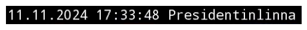
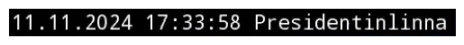

# YouTube Live Capture


<!-- WARNING: THIS FILE WAS AUTOGENERATED! DO NOT EDIT! -->

# Näkymä Helsingistä location list

# YouTube Capture Experiment

``` python
with youtube_dl.YoutubeDL(ydl_opts) as ydl:
    info = ydl.extract_info(nakyma_helsinkigista_youtube_live_url, download=False)
    for o in info['formats']:
        if o['resolution'] == '1280x720':
            print(o['url'])
            break
    else:
        raise ValueError("No 1280x720 format")
```

    [youtube] Extracting URL: https://www.youtube.com/watch?v=LMZQ7eFhm58
    [youtube] LMZQ7eFhm58: Downloading webpage
    [youtube] LMZQ7eFhm58: Downloading ios player API JSON
    [youtube] LMZQ7eFhm58: Downloading web creator player API JSON
    [youtube] LMZQ7eFhm58: Downloading m3u8 information
    https://manifest.googlevideo.com/api/manifest/hls_playlist/expire/1731361277/ei/nSUyZ7_VK6a80u8Pr9XG4Qc/ip/2001:14bb:693:814b:6cf8:466:4906:b913/id/LMZQ7eFhm58.4/itag/232/source/yt_live_broadcast/requiressl/yes/ratebypass/yes/live/1/sgovp/gir%3Dyes%3Bitag%3D136/rqh/1/hdlc/1/hls_chunk_host/rr5---sn-qo5-ixas.googlevideo.com/xpc/EgVo2aDSNQ%3D%3D/playlist_duration/3600/manifest_duration/3600/vprv/1/playlist_type/DVR/initcwndbps/1467500/met/1731339678,/mh/l8/mm/44/mn/sn-qo5-ixas/ms/lva/mv/m/mvi/5/pcm2cms/yes/pl/49/rms/lva,lva/dover/13/pacing/0/short_key/1/keepalive/yes/fexp/51312688,51326932/mt/1731339162/sparams/expire,ei,ip,id,itag,source,requiressl,ratebypass,live,sgovp,rqh,hdlc,xpc,playlist_duration,manifest_duration,vprv,playlist_type/sig/AJfQdSswRQIgFW9WJZ0GfBMxlRihLf2v4o741rOonQ5NivOu4kHwVx8CIQDA3g0dAE0BWx_BDkfyldNsF2z4Jf74xYomUYrSKs4UBA%3D%3D/lsparams/hls_chunk_host,initcwndbps,met,mh,mm,mn,ms,mv,mvi,pcm2cms,pl,rms/lsig/AGluJ3MwRgIhAK3opSPBuO135lJUjthUvwfChQaEONmaVsFidce2uE9gAiEAspdlt85ojgsBDa697pSlYP7X308ml8MSpMmKky605LM%3D/playlist/index.m3u8

------------------------------------------------------------------------

<a
href="https://github.com/ninjalabo/llmcam/blob/main/llmcam/ytlive.py#L45"
target="_blank" style="float:right; font-size:smaller">source</a>

### stream_url

>  stream_url (ytlive_url:str, ydl_opts:dict)

------------------------------------------------------------------------

<a
href="https://github.com/ninjalabo/llmcam/blob/main/llmcam/ytlive.py#L55"
target="_blank" style="float:right; font-size:smaller">source</a>

### show_frame

>  show_frame (frame)

------------------------------------------------------------------------

<a
href="https://github.com/ninjalabo/llmcam/blob/main/llmcam/ytlive.py#L62"
target="_blank" style="float:right; font-size:smaller">source</a>

### crop_frame

>  crop_frame (frame, crop=(0, 0, 480, 30))

------------------------------------------------------------------------

<a
href="https://github.com/ninjalabo/llmcam/blob/main/llmcam/ytlive.py#L67"
target="_blank" style="float:right; font-size:smaller">source</a>

### frame_to_text

>  frame_to_text (frame)

------------------------------------------------------------------------

<a
href="https://github.com/ninjalabo/llmcam/blob/main/llmcam/ytlive.py#L70"
target="_blank" style="float:right; font-size:smaller">source</a>

### known

>  known (txt:str, known_places:str)

*try to find one of `known_places` are included in the given `txt`*

``` python
assert known("Torninnnnnn", nakyma_helsinki_known_places)=="Torni"
```

------------------------------------------------------------------------

<a
href="https://github.com/ninjalabo/llmcam/blob/main/llmcam/ytlive.py#L79"
target="_blank" style="float:right; font-size:smaller">source</a>

### meta

>  meta (frame, known_places=['Olympiaterminaali', 'Etelasatama',
>            'Eteladsatama', 'Presidentinlinna', 'Tuomiokirkko', 'Kauppatori',
>            'Kauppator', 'Torni', 'Valkosaari'], printing=False)

*Withdraw meta data, datetime & place*

------------------------------------------------------------------------

<a
href="https://github.com/ninjalabo/llmcam/blob/main/llmcam/ytlive.py#L92"
target="_blank" style="float:right; font-size:smaller">source</a>

### fname

>  fname (prefix, dt, pl)

``` python
url = stream_url(nakyma_helsinkigista_youtube_live_url, ydl_opts)
cap = cv2.VideoCapture(url)
ret, frame = cap.read()
if ret:
    show_frame(crop_frame(frame))
    print(frame_to_text(crop_frame(frame)))
    try:
        print(fname("cap_", *meta(crop_frame(frame), printing=True)))
    except Exception as e:
        print(e)
else:
    print("Failed to capture frame.")
```

    [youtube] Extracting URL: https://www.youtube.com/watch?v=LMZQ7eFhm58
    [youtube] LMZQ7eFhm58: Downloading webpage
    [youtube] LMZQ7eFhm58: Downloading ios player API JSON
    [youtube] LMZQ7eFhm58: Downloading web creator player API JSON
    [youtube] LMZQ7eFhm58: Downloading m3u8 information



    11.11.2024 17:33:48 Presidentinlinna
    11.11.2024 17:33:48 Presidentinlinna
    cap_2024.11.11_17:33:48_Presidentinlinna.jpg

``` python
def capture_youtube_live_frame(youtube_live_url:str=nakyma_helsinkigista_youtube_live_url):
    "Capture a frame from the given YouTube Live URL and save into a JPEG file"

    url = stream_url(youtube_live_url, ydl_opts)
    cap = cv2.VideoCapture(url)
    ret, frame = cap.read()
    #show_frame(crop_frame(frame))
    if ret==False:
        raise Exception("Failed to capture frame.")
    try:        
        path = Path(os.getenv("LLMCAM_DATA", "../data"))/fname("cap_", *meta(crop_frame(frame), printing=True))
    except:
        path = Path(os.getenv("LLMCAM_DATA", "../data"))/fname("fail_", datetime.now(), "nowhere")
    path.parent.mkdir(parents=True, exist_ok=True)
    cv2.imwrite(path, frame)
    return path

file = capture_youtube_live_frame()
file
```

------------------------------------------------------------------------

<a
href="https://github.com/ninjalabo/llmcam/blob/main/llmcam/ytlive.py#L95"
target="_blank" style="float:right; font-size:smaller">source</a>

### YTLive

>  YTLive (url:str, data_dir:pathlib.Path=Path('../data'),
>              place:str='nowhere')

*Initialize self. See help(type(self)) for accurate signature.*

<table>
<thead>
<tr>
<th></th>
<th><strong>Type</strong></th>
<th><strong>Default</strong></th>
<th><strong>Details</strong></th>
</tr>
</thead>
<tbody>
<tr>
<td>url</td>
<td>str</td>
<td></td>
<td>YouTube Live URL</td>
</tr>
<tr>
<td>data_dir</td>
<td>Path</td>
<td>../data</td>
<td>directory to store captured images</td>
</tr>
<tr>
<td>place</td>
<td>str</td>
<td>nowhere</td>
<td>place name</td>
</tr>
</tbody>
</table>

``` python
SantaClausVilledge = YTLive(url="https://www.youtube.com/live/Cp4RRAEgpeU?si=IwqJ4QU1Umv9PdgW", place="santaclausvillege")
file = SantaClausVilledge()
file
```

    [youtube] Extracting URL: https://www.youtube.com/live/Cp4RRAEgpeU?si=IwqJ4QU1Umv9PdgW
    [youtube] Cp4RRAEgpeU: Downloading webpage
    [youtube] Cp4RRAEgpeU: Downloading ios player API JSON
    [youtube] Cp4RRAEgpeU: Downloading web creator player API JSON
    [youtube] Cp4RRAEgpeU: Downloading m3u8 information

    Path('../data/cap_2024.11.11_17:41:25_santaclausvillege.jpg')

------------------------------------------------------------------------

<a
href="https://github.com/ninjalabo/llmcam/blob/main/llmcam/ytlive.py#L123"
target="_blank" style="float:right; font-size:smaller">source</a>

### NHsta

>  NHsta (url:str='https://www.youtube.com/watch?v=LMZQ7eFhm58',
>             data_dir:pathlib.Path=Path('../data'), place:str='unclear')

*Initialize self. See help(type(self)) for accurate signature.*

<table>
<colgroup>
<col style="width: 6%" />
<col style="width: 25%" />
<col style="width: 34%" />
<col style="width: 34%" />
</colgroup>
<thead>
<tr>
<th></th>
<th><strong>Type</strong></th>
<th><strong>Default</strong></th>
<th><strong>Details</strong></th>
</tr>
</thead>
<tbody>
<tr>
<td>url</td>
<td>str</td>
<td>https://www.youtube.com/watch?v=LMZQ7eFhm58</td>
<td>YouTube Live URL</td>
</tr>
<tr>
<td>data_dir</td>
<td>Path</td>
<td>../data</td>
<td>directory to store captured images</td>
</tr>
<tr>
<td>place</td>
<td>str</td>
<td>unclear</td>
<td>place name if OCR doesn’t work</td>
</tr>
</tbody>
</table>

``` python
NakymaHelsingista = NHsta()
file = NakymaHelsingista()
file
```

    [youtube] Extracting URL: https://www.youtube.com/watch?v=LMZQ7eFhm58
    [youtube] LMZQ7eFhm58: Downloading webpage
    [youtube] LMZQ7eFhm58: Downloading ios player API JSON
    [youtube] LMZQ7eFhm58: Downloading web creator player API JSON
    [youtube] LMZQ7eFhm58: Downloading m3u8 information
    SR ILO ee
    cap_2024.11.11_17:48:51_unclear.jpg

    Path('../data/cap_2024.11.11_17:48:51_unclear.jpg')

``` python
def crop_image(path, crop=(0, 0, 480, 30)): return Image.open(path).crop(crop)
def show_image(path):
    plt.imshow(crop_image(path))
    plt.axis('off')
    plt.show()

show_image(file)
```



# Extract meta data from an image file

``` python
try:
    fname("cap_", *meta(files[1]))
except:
    pass
```

## Rename files with meta info

“cap_2024.10.04_14:56:49_Presidentinlinna”

“cap_2024.10.06_19:04:14_Kauppatori”

“cap_2024.10.06_20:08:29_Kauppatori”

``` python
for i, o in enumerate(glob.glob("../data/cap_*_unclear.jpg")):
    try:
        new = Path("../data")/fname("cap_", *meta(o, True))
        print(i, o, " -> ", new)
        os.rename(o, new)
    except Exception as e:
        print(o)
```

    ../data/cap_2024.11.11_16:18:12_unclear.jpg
    ../data/cap_2024.11.11_15:31:04_unclear.jpg
    ../data/cap_2024.11.11_15:33:25_unclear.jpg
    ../data/cap_2024.11.11_15:40:50_unclear.jpg
    ../data/cap_2024.11.11_15:39:09_unclear.jpg
    ../data/cap_2024.11.11_15:30:46_unclear.jpg
